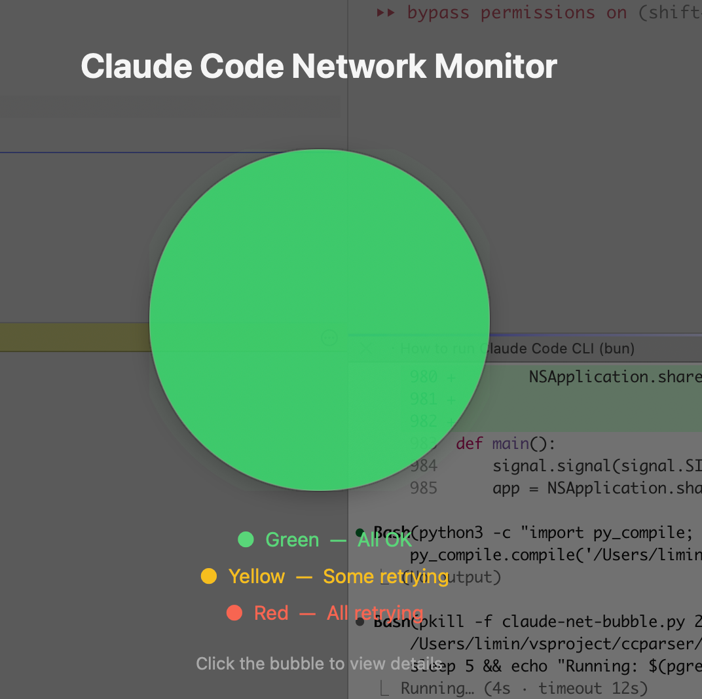
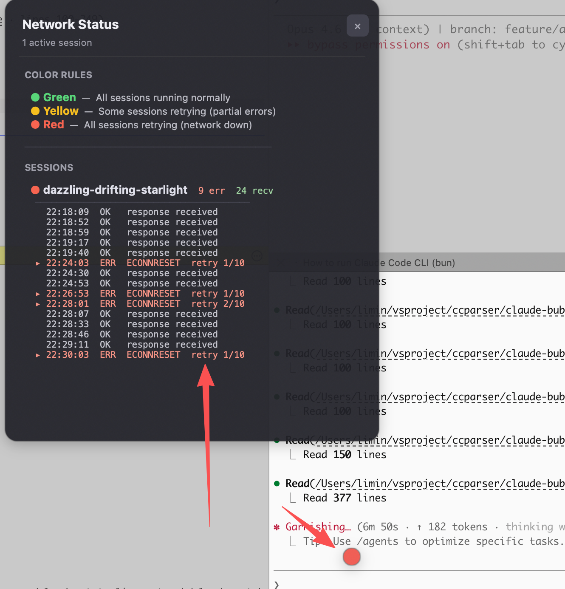

[English](#claude-code-network-bubble) | [中文说明](#claude-code-network-bubble-中文说明)

# Claude Code Network Bubble (中文说明)

macOS 桌面悬浮气泡，实时监控 Claude Code 会话的网络状态。

## 功能说明

桌面上会出现一个小圆球，根据网络状态自动变色：

- **绿色** - 所有会话正常运行
- **黄色** - 部分会话出现网络错误，正在重试
- **红色** - 所有会话都在重试（网络异常）

### 交互方式

| 操作 | 效果 |
|------|------|
| **悬停** | 显示每个会话的状态摘要 |
| **拖拽** | 移动气泡到屏幕任意位置 |
| **单击** | 弹出详细面板，包含颜色规则说明和网络事件日志 |

### 启动动画

启动时，屏幕中央会出现一个大号脉冲气泡，配合半透明遮罩展示：
- 程序名称
- 三种颜色的含义
- 操作提示（单击查看详情）

停留数秒后，气泡缩小并飞向屏幕右上角。

### 截图

| 启动动画 | 详情面板（单击打开） |
|:-:|:-:|
|  |  |

### 多会话支持

自动监控所有活跃的 Claude Code 会话（10 分钟内有更新的）。如果你同时打开了多个 Claude Code 窗口，气泡会统一追踪。

## 工作原理

Claude Code 会将会话事件写入 `~/.claude/projects/` 下的 JSONL 文件。气泡每 2 秒读取这些文件的尾部，对比：

- 最近一条 **`api_error`**（网络错误 + 重试次数）
- 最近一条 **成功的 `assistant` 响应**

如果最后一条错误比最后一条成功更新，说明该会话正在重试。

所有时间戳均以**本机时区**显示。

> **注意：** 本工具依赖 Claude Code 内部的 JSONL 日志格式，该格式非公开 API，可能随版本更新变化。

## 安装

### 前置条件

- macOS
- Python 3.9+
- [Claude Code](https://docs.anthropic.com/en/docs/claude-code)

### 安装步骤

```bash
# 安装 macOS Python 桥接库
pip3 install pyobjc-framework-Cocoa

# 下载脚本
curl -o ~/.claude/claude-net-bubble.py \
  https://raw.githubusercontent.com/limin112/claudebubble/main/claude-net-bubble.py
```

### 手动运行

```bash
nohup python3 ~/.claude/claude-net-bubble.py &
```

### 随 Claude Code 自动启动（推荐）

在 `~/.claude/settings.json` 中添加 `SessionStart` 钩子：

```json
{
  "hooks": {
    "SessionStart": [
      {
        "hooks": [
          {
            "type": "command",
            "command": "pgrep -f claude-net-bubble.py > /dev/null || nohup python3 ~/.claude/claude-net-bubble.py > /dev/null 2>&1 &",
            "async": true
          }
        ]
      }
    ]
  }
}
```

首次启动 Claude Code 时会自动运行气泡，之后的会话复用同一个进程。

### 停止

```bash
pkill -f claude-net-bubble.py
```

## 配置项

编辑 `claude-net-bubble.py` 顶部的常量：

| 常量 | 默认值 | 说明 |
|------|--------|------|
| `BUBBLE_SIZE` | `20` | 气泡直径（像素） |
| `SPLASH_SIZE` | `260` | 启动动画气泡大小 |
| `CHECK_INTERVAL` | `2.0` | 状态检查间隔（秒） |
| `ACTIVE_WINDOW_SECS` | `600` | 会话活跃窗口期（秒） |
| `SPLASH_HOLD_SECS` | `3.5` | 启动动画停留时长（秒） |

## 许可证

MIT

---

[中文说明](#claude-code-network-bubble-中文说明) | [English](#claude-code-network-bubble)

# Claude Code Network Bubble

A floating desktop bubble for macOS that monitors your Claude Code sessions' network health in real time.


## What it does

A small floating circle sits on your desktop and changes color based on network status:

- **Green** - All sessions healthy
- **Yellow** - Some sessions experiencing network errors
- **Red** - All sessions retrying

### Interactions

| Action | Result |
|--------|--------|
| **Hover** | Tooltip showing per-session status |
| **Drag** | Move the bubble anywhere on screen |
| **Click** | Detailed network event log with color rules |

### Startup animation

On launch, a large pulsing bubble appears at the center of the screen with an overlay explaining the color rules and usage. After a few seconds it shrinks and flies to the top-right corner.

### Screenshots

| Startup splash | Detail panel (click to open) |
|:-:|:-:|
|  |  |

### Multi-session support

Automatically monitors **all active Claude Code sessions** (modified within the last 10 minutes). If you have multiple Claude Code windows open, the bubble tracks them all.

## How it works

Claude Code writes session events to JSONL transcript files at `~/.claude/projects/`. The bubble reads the tail of these files every 2 seconds and compares:

- The **last `api_error`** entry (network failure + retry attempt)
- The **last successful `assistant` response**

If the last error is newer than the last success, that session is actively retrying.

All timestamps are displayed in your **local timezone**.

> **Note:** This relies on Claude Code's internal JSONL transcript format, which is not a public API and may change between versions.

## Install

### Prerequisites

- macOS
- Python 3.9+
- [Claude Code](https://docs.anthropic.com/en/docs/claude-code)

### Setup

```bash
# Install the macOS Python bridge
pip3 install pyobjc-framework-Cocoa

# Download the script
curl -o ~/.claude/claude-net-bubble.py \
  https://raw.githubusercontent.com/limin112/claudebubble/main/claude-net-bubble.py
```

### Run manually

```bash
# Run in background
nohup python3 ~/.claude/claude-net-bubble.py &
```

### Auto-start with Claude Code (recommended)

Add a `SessionStart` hook to `~/.claude/settings.json`:

```json
{
  "hooks": {
    "SessionStart": [
      {
        "hooks": [
          {
            "type": "command",
            "command": "pgrep -f claude-net-bubble.py > /dev/null || nohup python3 ~/.claude/claude-net-bubble.py > /dev/null 2>&1 &",
            "async": true
          }
        ]
      }
    ]
  }
}
```

This starts the bubble on your first Claude Code session and keeps it running across sessions.

### Stop

```bash
pkill -f claude-net-bubble.py
```

## Configuration

Edit the constants at the top of `claude-net-bubble.py`:

| Constant | Default | Description |
|----------|---------|-------------|
| `BUBBLE_SIZE` | `20` | Bubble diameter in pixels |
| `SPLASH_SIZE` | `260` | Startup splash bubble size |
| `CHECK_INTERVAL` | `2.0` | Seconds between status checks |
| `ACTIVE_WINDOW_SECS` | `600` | Consider sessions active if modified within this window (seconds) |
| `SPLASH_HOLD_SECS` | `3.5` | How long the startup splash stays before shrinking |

## JSONL format reference

Network errors in the session log:

```json
{
  "type": "system",
  "subtype": "api_error",
  "cause": { "code": "ECONNRESET" },
  "retryAttempt": 3,
  "maxRetries": 10,
  "timestamp": "2026-03-30T15:27:34.050Z"
}
```

Successful responses:

```json
{
  "type": "assistant",
  "message": { "stop_reason": "end_turn" },
  "timestamp": "2026-03-30T15:28:17.959Z"
}
```

## License

MIT
